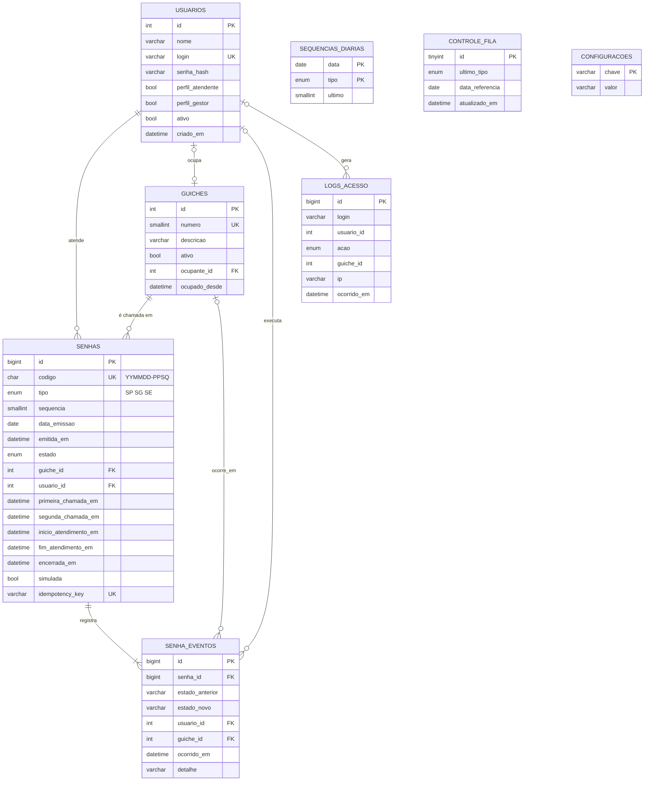

# Modelo entidade relacionamento

## Dicionário de dados resumido

| Tabela | Finalidade | Observações |
|---|---|---|
| usuarios | Atendentes e gestores | senha_hash em bcrypt; login único |
| guiches | Postos de atendimento | ocupante_id impede dois atendentes no mesmo guichê |
| senhas | Uma linha por senha | horários usados nos relatórios; índice (estado, tipo, data_emissao, id) para a fila |
| senha_eventos | Trilha de auditoria | gravada na mesma transação da mudança de estado |
| sequencias_diarias | Contador por dia e tipo | incremento atômico com LAST_INSERT_ID |
| controle_fila | Último tipo chamado | linha única bloqueada com FOR UPDATE a cada chamada |
| configuracoes | Expediente e modo demonstração | chave e valor |
| logs_acesso | Segurança | base do bloqueio após tentativas falhas |

O script completo está em `backend/database/schema.sql`.
