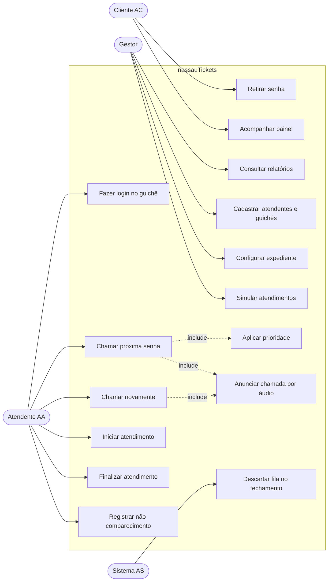

# Casos de uso

```mermaid
flowchart LR
    AC([Cliente AC])
    AA([Atendente AA])
    G([Gestor])
    AS([Sistema AS])

    subgraph nassauTickets
      UC1[Retirar senha]
      UC2[Acompanhar painel]
      UC3[Fazer login no guichê]
      UC4[Chamar próxima senha]
      UC5[Chamar novamente]
      UC6[Iniciar atendimento]
      UC7[Finalizar atendimento]
      UC8[Registrar não comparecimento]
      UC9[Consultar relatórios]
      UC10[Cadastrar atendentes e guichês]
      UC11[Configurar expediente]
      UC12[Simular atendimentos]
      UC13[Aplicar prioridade]
      UC14[Anunciar chamada por áudio]
      UC15[Descartar fila no fechamento]
    end

    AC --> UC1
    AC --> UC2
    AA --> UC3
    AA --> UC4
    AA --> UC5
    AA --> UC6
    AA --> UC7
    AA --> UC8
    G --> UC9
    G --> UC10
    G --> UC11
    G --> UC12
    UC4 -. include .-> UC13
    UC4 -. include .-> UC14
    UC5 -. include .-> UC14
    AS --> UC15
```

O gestor é um atendente com perfil adicional; ele também executa todos os casos de uso do atendente.
