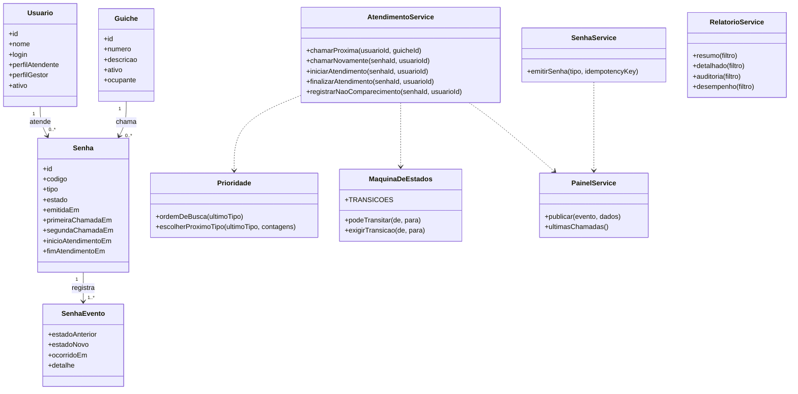

# Diagrama de classes (visão de domínio e serviços)

```mermaid
classDiagram
    class Usuario {
      +id
      +nome
      +login
      +perfilAtendente
      +perfilGestor
      +ativo
    }
    class Guiche {
      +id
      +numero
      +descricao
      +ativo
      +ocupante
    }
    class Senha {
      +id
      +codigo
      +tipo
      +estado
      +emitidaEm
      +primeiraChamadaEm
      +segundaChamadaEm
      +inicioAtendimentoEm
      +fimAtendimentoEm
    }
    class SenhaEvento {
      +estadoAnterior
      +estadoNovo
      +ocorridoEm
      +detalhe
    }
    class Prioridade {
      +ordemDeBusca(ultimoTipo)
      +escolherProximoTipo(ultimoTipo, contagens)
    }
    class MaquinaDeEstados {
      +TRANSICOES
      +podeTransitar(de, para)
      +exigirTransicao(de, para)
    }
    class SenhaService {
      +emitirSenha(tipo, idempotencyKey)
    }
    class AtendimentoService {
      +chamarProxima(usuarioId, guicheId)
      +chamarNovamente(senhaId, usuarioId)
      +iniciarAtendimento(senhaId, usuarioId)
      +finalizarAtendimento(senhaId, usuarioId)
      +registrarNaoComparecimento(senhaId, usuarioId)
    }
    class RelatorioService {
      +resumo(filtro)
      +detalhado(filtro)
      +auditoria(filtro)
      +desempenho(filtro)
    }
    class PainelService {
      +publicar(evento, dados)
      +ultimasChamadas()
    }

    Usuario "1" --> "0..*" Senha : atende
    Guiche "1" --> "0..*" Senha : chama
    Senha "1" --> "1..*" SenhaEvento : registra
    AtendimentoService ..> Prioridade
    AtendimentoService ..> MaquinaDeEstados
    AtendimentoService ..> PainelService
    SenhaService ..> PainelService
```
