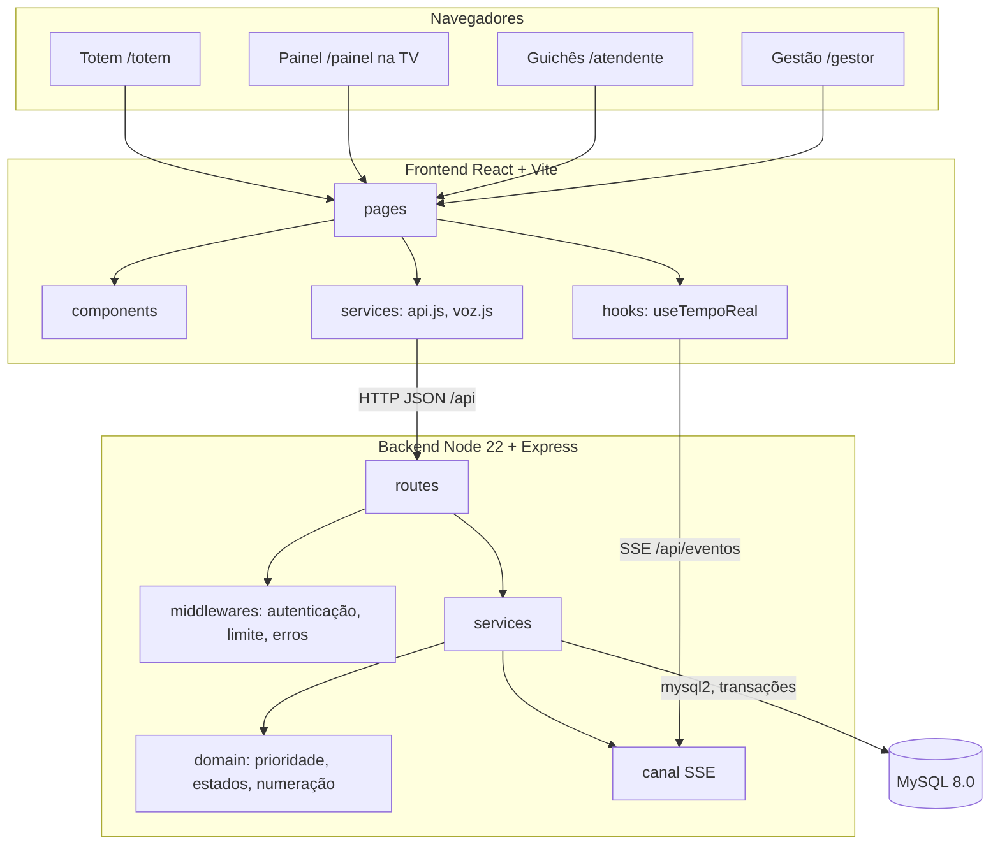

# Componentes e implantação

```mermaid
flowchart TB
    subgraph Navegadores
      TO[Totem /totem]
      PA[Painel /painel na TV]
      AT[Guichês /atendente]
      GE[Gestão /gestor]
    end
    subgraph Frontend React + Vite
      PG[pages] --> CP[components]
      PG --> SV[services: api.js, voz.js]
      PG --> HK[hooks: useTempoReal]
    end
    subgraph Backend Node 22 + Express
      RT[routes] --> MW[middlewares: autenticação, limite, erros]
      RT --> SE[services]
      SE --> DM[domain: prioridade, estados, numeração]
      SE --> SSE[canal SSE]
    end
    DB[(MySQL 8.0)]

    TO & PA & AT & GE --> PG
    SV -- HTTP JSON /api --> RT
    HK -- SSE /api/eventos --> SSE
    SE -- mysql2, transações --> DB
```
