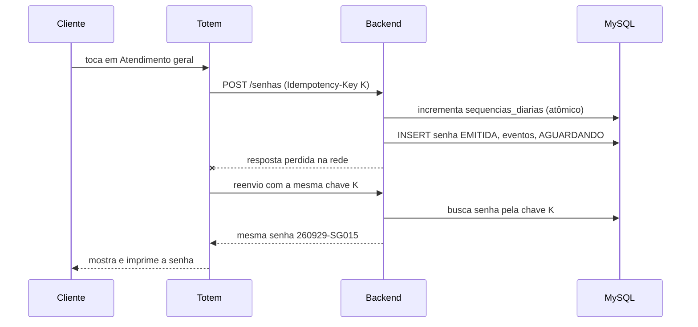

# Sequência: emissão no totem com falha de rede

```mermaid
sequenceDiagram
    participant C as Cliente
    participant T as Totem
    participant API as Backend
    participant DB as MySQL

    C->>T: toca em Atendimento geral
    T->>API: POST /senhas (Idempotency-Key K)
    API->>DB: incrementa sequencias_diarias (atômico)
    API->>DB: INSERT senha EMITIDA, eventos, AGUARDANDO
    API--xT: resposta perdida na rede
    T->>API: reenvio com a mesma chave K
    API->>DB: busca senha pela chave K
    API-->>T: mesma senha 260929-SG015
    T-->>C: mostra e imprime a senha
```
