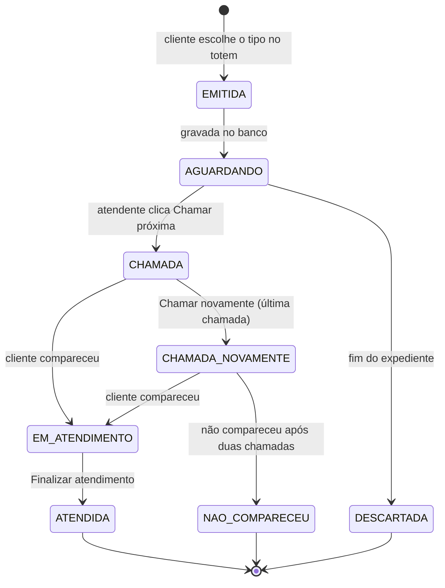

# Máquina de estados da senha

| De | Para | Quem | Campo gravado |
|---|---|---|---|
| (nenhum) | EMITIDA | Cliente | emitida_em |
| EMITIDA | AGUARDANDO | Sistema | |
| AGUARDANDO | CHAMADA | Atendente | primeira_chamada_em, guiche_id, usuario_id |
| CHAMADA | CHAMADA_NOVAMENTE | Atendente | segunda_chamada_em |
| CHAMADA ou CHAMADA_NOVAMENTE | EM_ATENDIMENTO | Atendente | inicio_atendimento_em |
| EM_ATENDIMENTO | ATENDIDA | Atendente | fim_atendimento_em |
| CHAMADA_NOVAMENTE | NAO_COMPARECEU | Atendente | encerrada_em |
| EMITIDA ou AGUARDANDO | DESCARTADA | Sistema | encerrada_em |
